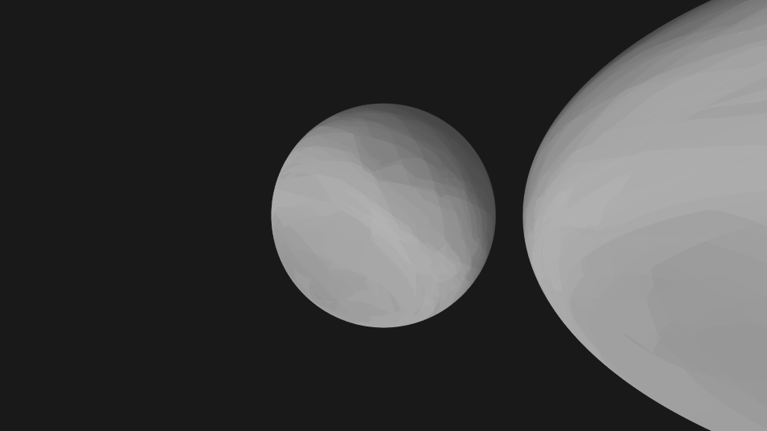
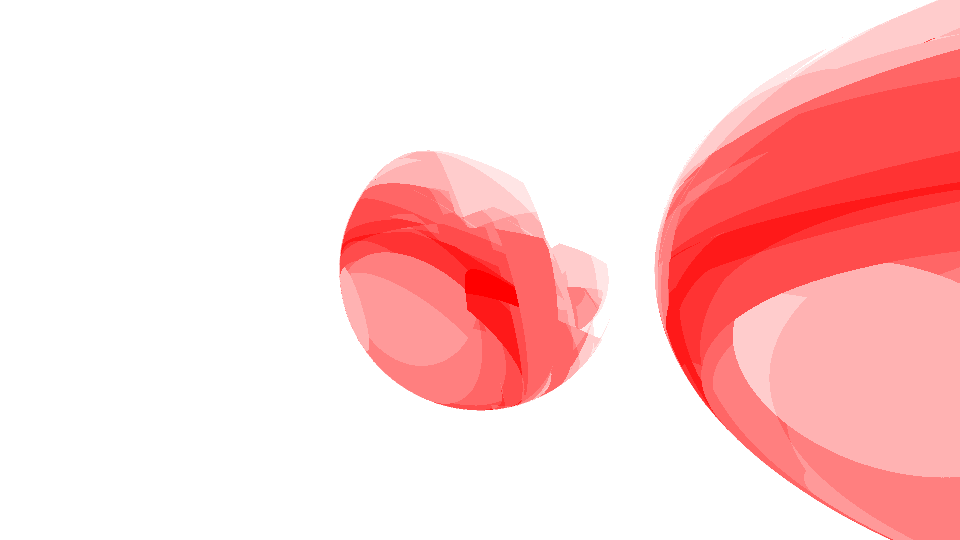

# Bug-Images

While fixing bugs, I often generate interesting images that arise from a problem in the shader code or outputting debug values as color. I have made some of these available [here](bug-images/README.md)

#### Random Number Count

#### Number Of Ray Bounces

